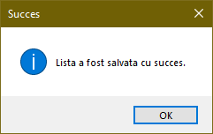

# Lista Cumparaturi

 Aplicatie ce faciliteaza crearea de liste de cumparaturi.

Functionalitatea aplicatiei este aceea de a crea liste adaptate pe modelul listelor de cumparaturi, sub forma de tabele cu 4 coloane: *Numar Curent*,  *Produs (Denumire)*, *Unitatea de Masura* si *Cantitatea*. Aceste liste vor fi salvate sub forma unui fisier Excel.

Datele se vor introduce in tabel cu ajutorul unui formular de adaugare a datelor, ce va aparea pe ecran la apasarea butonului *Adauga Produs*, in care se vor introduce valorile dorite pentru campurile referitoare la denumire, unitatea de masura si cantitatea din produs, campul *Numar Curent* fiind unul autocompletat la confirmarea adaugarii produsului dorit.

In cazul in care se doreste modificarea datelor introduse cu privire la un anumit produs, acest lucru se va realiza prin selectarea tuplului aferent produsului asupra caruia se doreste sa se faca modificarea, apoi se va apasa butonul *Modifica Produs* care va afisa pe ecran un formular de modificare a datelor in care se vor putea modifica oricare din campurile referitoare la denumirea, unitatea de masura sau cantitatea produsului selectat.

Daca se doreste eliminarea unui produs din lista, se va selecta tuplul aferent produsului care se doreste a fi sters si se va apasa butonul denumit *Sterge Produs*.

## Exemplificare

Dupa introducerea de produse in lista, aceasta arata astfel:

Pentru a salva lista creata se va apasa butonul *Salvare Lista* care va deschide o fereastra de tipul *Save as* si vom putea alege locul in care sa salvam fisierul si denumirea acestuia.

 Dupa confirmarea salvarii va aparea mesajul ca fisierul s-a salvat cu succes.

Putem vizualiza fisierul creat in Excel:

